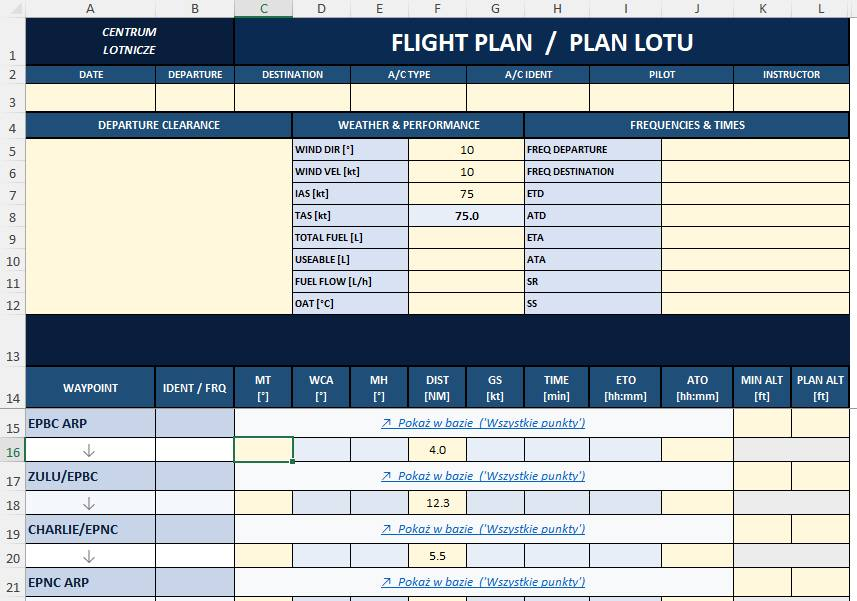

# PlanLotu PPL-A – Automatyczny Plan Lotu VFR w Excelu

## 📌 Założenia projektu

Celem projektu jest stworzenie arkusza **Excel**, który – po podaniu trasy lotniczej (punktów VFR) – **automatycznie wyliczy wszystkie kluczowe parametry planu lotu**:

- **Kurs Geograficzny (KG)** – kurs zmierzony na mapie względem północy geograficznej,
- **Deklinacja magnetyczna (d)** – poprawka wynikająca z różnicy między północą geograficzną a magnetyczną,
- **Kurs Magnetyczny (KM)** – `KG ± d`,
- **Kurs Busoli (KB)** – `KM ± δ`,
- **Odległość (NM)** – odległość między kolejnymi punktami trasy,
- **Prędkość rzeczywista (TAS)** – na podstawie podanej prędkości wskazanej i warunków atmosferycznych,
- **Kąt znoszenia (α)** – wpływ wiatru na kurs,
- **Kurs do lotu (HDG)** – kurs do zachowania po uwzględnieniu wiatru,
- **Czas przelotu** – dla każdego odcinka i łącznie,
- **Zużycie paliwa** – na każdy odcinek i łącznie, z uwzględnieniem rezerwy.

> ⚠️ **Projekt nie ma być w pełni automatycznym narzędziem, lecz czytelną wskazówką** – jak krok po kroku wykonać plan lotu, z gotowymi formułami do wdrożenia w Excelu lub LibreOffice Calc.

---

## 📂 Obecny stan repozytorium

- ✅ **Zebrane punkty VFR** – lista punktów raportowania stosowanych w polskiej przestrzeni powietrznej,
- ✅ **Template Planu Lotu** – szablon arkusza z nagłówkami kolumn i przykładowym układem,
- ✅ **FlightPlan_Automatic** – arkusz, który **automatycznie oblicza odległość między punktami trasy** na podstawie ich współrzędnych. Wkrótce również: automatyczne obliczanie kursu (MT/MH), czasu przelotu, zużycia paliwa i pozostałych parametrów.

---

## 🖼️ Przykład – FlightPlan_Automatic



---

## 🗺️ Roadmapa

- [ ] Dodanie formuł Excela do automatycznego przeliczania kursów (KG → KM → KB),
- [X] Przeliczanie odległości na podstawie współrzędnych punktów VFR,
- [ ] Uwzględnienie wiatru i wyliczanie kąta znoszenia,
- [ ] Automatyczne wyliczanie czasu przelotu,
- [ ] Automatyczne wyliczanie zapotrzebowania na paliwo (z rezerwą),
- [ ] Integracja danych METAR/TAF dla aktualnych warunków pogodowych (opcja przyszłościowa),
- [ ] Dokumentacja z opisem każdej formuły i objaśnieniem metody.

---

## ✈️ Podstawowe wzory

### Kurs Magnetyczny
```
KM = KG - d   (gdy deklinacja wschodnia)
KM = KG + d   (gdy deklinacja zachodnia)
```

### Kurs Busoli
```
KB = KM - δ   (gdy odchyłka busoli jest „+"w danym kwadrancie)
KB = KM + δ   (gdy odchyłka busoli jest „-")
```

### Kąt znoszenia (przybliżona metoda)
```
α = arcsin( Vw * sin(kąt_wiatru) / TAS )
```

### Kurs do lotu
```
HDG = KM + α
```

### Czas przelotu
```
t [min] = (Odległość [NM] / TAS [kt]) * 60
```

### Zużycie paliwa
```
Paliwo [L] = Spalanie [L/h] * t [h]
```

---

## 🤝 Jak to się robi w dzisiejszych czasach – **Vibe Coding**

Projekt powstaje w duchu wspólnego kodowania i dzielenia się wiedzą. Każdy, kto zna przepisy PPL-A, Excela lub po prostu lubi lotnictwo – jest mile widziany!

**Zapraszam do komentowania, zgłaszania issues i rozwijania projektu. 🛩️**

---

## 📄 Licencja

Projekt udostępniony na zasadach open-source. Szczegóły w pliku `LICENSE`.
